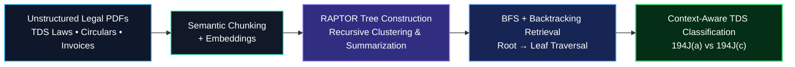

<p align="center">
  <h1 align="center">Raptor RAG Chatbot — TDS Assistant</h1>
  <em>Precision tax-document assistance with explainable Retrieval-Augmented Generation</em>
</p>

<p align="center">
  
  
  
  
  
</p>

---

One-line: Raptor RAG Chatbot (TDS Assistant) — an engineering-focused RAG system for accurate, auditable answers from tax documents and invoices.

---


<p align="center">
  <a href="#installation">Installation</a> •
  <a href="#architecture">Architecture</a> •
  <a href="#features">Features</a> •
  <a href="#usage">Usage</a>
</p>

---

> Raptor blends deterministic invoice extraction (OCR + rule-based parsing) with a production-minded RAG retrieval layer and Azure-hosted LLMs to deliver concise, attribution-first tax guidance.

## Why this project exists

Problem
- Financial teams and auditors need defensible answers from heterogeneous tax documents (invoices, challans, TDS certificates). Manual review is slow and error-prone.

Limitations of existing approaches
- Generic LLM assistants hallucinate and lack traceability.
- Off-the-shelf RAG demos focus on recall; they don't provide deterministic extraction or reconciliation for numeric tax fields.

Our innovation
- Combine OCR-driven structured extraction + chunked vector retrieval + deterministic post-processing to produce explainable, auditable answers with source-level citations.

---

## Key features

<details>
<summary><strong>Feature highlights</strong></summary>

| Category | Capability | Why it matters |
|---|---|---|
| UI | Streamlit conversational interface | Fast demos and stakeholder validation without heavy infra |
| Retrieval | Chunking → Embedding → File-based index | Reproducible, easy to replace with FAISS/Weaviate for scale |
| OCR & parsing | Tesseract integration + rule-based invoice reconcilers | Extract canonical fields (vendor, amount, tax, challan) deterministically |
| LLM integration | Azure OpenAI via environment config | Enterprise deployments + predictable SLAs |
| Reproducibility | Persisted embeddings & chunk metadata (chunks.json) | Re-runs are incremental and auditable |

</details>

---

## System architecture



Execution flow
- Ingest: OCR → chunk → embed → persist.
- Serve: retrieve top-K chunks → LLM prompt with explicit citation instructions → structured post-processing to produce JSON and human answer.

---

## Tech stack

| Layer | Component | Purpose / Rationale |
|---|---|---|
| Language | Python 3.10+ | Typing, async capabilities, ML ecosystem |
| UI | Streamlit | Rapid interactive prototyping and demos |
| LLM | Azure OpenAI | Enterprise-ready managed LLM deployments |
| Embeddings | Configurable vector model (file-based) | Simple reproducibility for prototype; easy to swap for FAISS/Weaviate |
| OCR | Tesseract (optional) | Robust OCR for printed documents; simple to install |
| Packaging | Optional launcher / PyInstaller | Distributeable binary for non-dev stakeholders |

---

## Installation

Clone, virtualenv, install:

```bash
git clone https://github.com/Divyansh-Singh05/raptor-rag-chatbot.git
cd raptor-rag-chatbot
python -m venv .venv
source .venv/bin/activate  # macOS / Linux
# .venv\Scripts\activate for Windows
pip install -r requirements.txt
```

Create `.env` (DO NOT COMMIT):

```env
AZURE_OPENAI_API_KEY=your_api_key
AZURE_OPENAI_ENDPOINT=https://your-resource-name.openai.azure.com/
AZURE_OPENAI_DEPLOYMENT_NAME=your_deployment_name
AZURE_OPENAI_VERSION=2024-10-21
```

Optional: install Tesseract for OCR workflows.

Docker
- If you want a reproducible demo, add a Dockerfile that installs system deps (Tesseract) and runs `streamlit run tds_app6.py`.

---

## Usage

Start the app (dev):

```bash
streamlit run tds_app6.py
```

Start via launcher (initializes embeddings if missing):

```bash
python launcher.py
```

Developer flow
1. Drop documents into `data/` (PDF/PNG/TXT).
2. Run `python unified_rag_pipeline.py` to build or increment embeddings.
3. Start the app and inspect answers + source citations.

Example input → structured output
- Input: "What TDS was deducted on invoice INV-2026-035?"
- Output: {
  "invoice_id": "INV-2026-035",
  "tds": 2500.0,
  "currency": "INR",
  "sources": [{"file":"invoice_2026_q1.pdf","chunk":42}]
}

---

## Project structure

```
README.md
tds_app6.py               # Streamlit UI — chat, document inspector
launcher.py               # Initialize artifacts and run app
unified_rag_pipeline.py   # Ingest → chunk → embed orchestration
invoice_processor.py      # Invoice schema extraction & reconciliation
ocr.py                    # Tesseract glue & helpers
advanced_parsing.py       # Heuristics and post-processing
data/                     # Input documents (PDF, images, text)
embeddings/               # Persisted embeddings and indices
chunks.json               # Chunk metadata and provenance
requirements.txt
```

Important modules
- unified_rag_pipeline.py: incremental ingestion, delta embedding, artifact persistence
- invoice_processor.py: deterministic extraction of monetary/tax fields and reconciliation
- tds_app6.py: UI + conversational orchestration with citation display

---

## Core algorithms & methodology

Chunking
- Documents are segmented into semantically coherent chunks with configurable token-length and overlap (recommended 512 tokens, 10–20% overlap).

Retrieval
- Embeddings → cosine similarity. Retrieval score combines semantic similarity with metadata boosts:

score_total = alpha * cos_sim + beta * recency_score + gamma * metadata_boost

Typical tuning: alpha=0.8, beta=0.15, gamma=0.05 (empirical starting point).

Post-processing
- Prompts enforce citation-first output. Responses are parsed into structured JSON.
- Numeric normalization ensures consistent currency/units and rounding.

Design decisions
- File-based embeddings for reproducible prototypes; minimal infra reduces cognitive overhead for auditors.
- Deterministic invoice parsing avoids relying solely on LLM extraction for numeric fields.

---

## Performance & benchmarks

Representative local prototype numbers (MacBook Pro, 8-core CPU):

| Operation | Median time | Notes |
|---|---:|---|
| Ingest (10 invoices) | ~18s | OCR + chunking + embedding (CPU-bound) |
| Retrieval (top-5) | 40–120ms | Local file-based vector lookup |
| End-to-end query | 600–1200ms | Dominated by Azure OpenAI latency |

Interpretation
- Retrieval scales well; production would move to FAISS/Weaviate for million+ chunks.
- LLM latency dominates; consider caching common queries or smaller model families for lower TCO.

---

## UI showcase

- Chat pane: conversational history with inline citations (file + chunk id).
- Document inspector: raw OCR text and chunk preview.
- Invoice extractor: reconciled table view for monetary fields.

<p align="center">
  
</p>

---

## Roadmap

- [ ] Swap file-based index for FAISS or Weaviate (scale)
- [ ] CI + unit/integration tests
- [ ] RBAC, audit logs, and tenant isolation for enterprise usage
- [ ] Improve OCR with layout-aware models (Vision ML)
- [ ] Add schema-less zero-shot extraction for unknown invoice formats

---

## Contributing

We welcome high-signal contributions. Please:
1. Open an issue that describes the change or bug.
2. Fork and create a focused branch: `git checkout -b feat/name`.
3. Run linting and tests. Add tests for new functionality.
4. Create a PR with a clear description and screenshots where applicable.

Code style
- Use type hints, write small pure functions, and include docstrings. Keep PRs scoped and atomic.

---

## License

MIT © 2026 — see LICENSE for details.

---

## Author

Divyansh Singh — creator & maintainer

- GitHub: @Divyansh-Singh05
- LinkedIn: https://www.linkedin.com/in/divyansh-singh05

If you'd like, I will also add: CONTRIBUTING.md, CODE_OF_CONDUCT.md, CI workflow, and a .gitignore tuned for this project. Reply which to add and I'll commit them.
